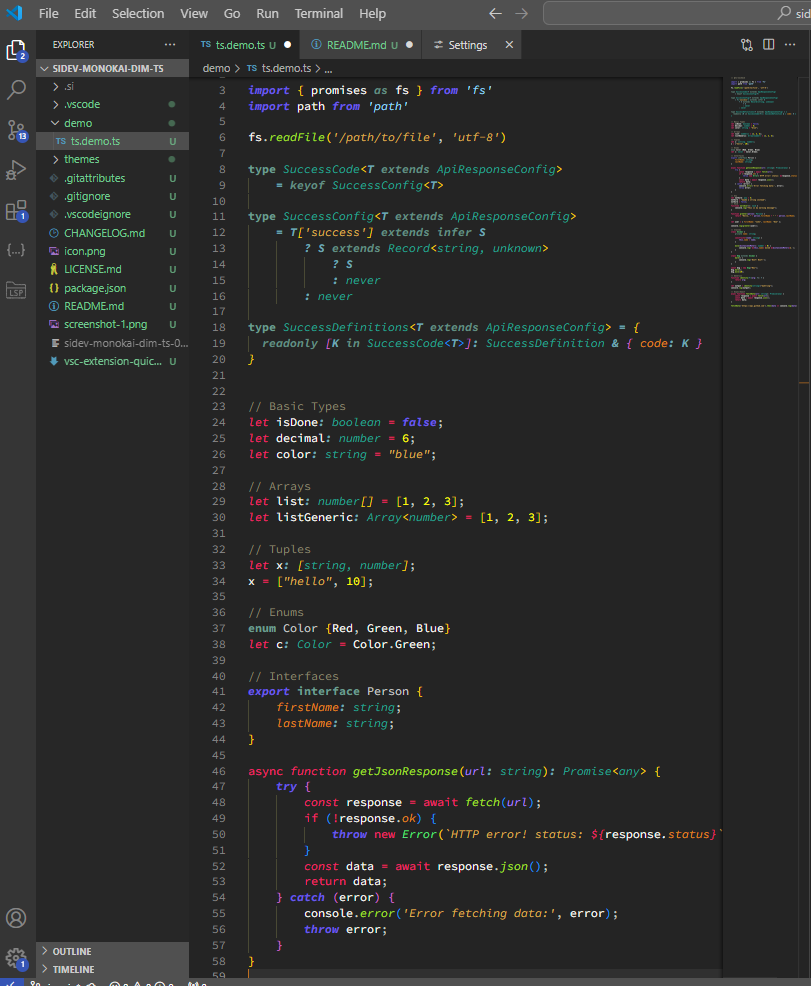

# Sidev Monokai Dim TS

A dark theme for VS Code that emphasizes `runtime logic` while subtly displaying `TypeScript` type information. This unique approach helps developers focus on program behavior while keeping type information accessible but unobtrusive.

_`Perfect for JavaScript developers transitioning to TypeScript`_ - the theme's visual hierarchy helps you maintain your JavaScript mindset while gradually embracing TypeScript's type system. 

By making type information visually separated and subtle, you can focus on your familiar coding patterns while TypeScript's safety net works quietly in the background.

## Design Features

- **Runtime First**: Runtime elements are bright and clear, making program flow and behavior immediately apparent
- **Types in Background**: TypeScript types and annotations are slightly dimmed and italicized, providing type information without visual distraction
- **Visual Hierarchy**: Creates natural distinction between what happens at runtime vs compile time
- **Subtle tweaks**: For TSX/JSX, HTML, CSS, and MD/MDX syntax.

## Clarity and Focus

## Color Scheme

### Emphasized Runtime Elements
- Function names: `#A6E22E` (italic)
- Property access: `#E48B1D` (italic)
- Classes: `#5ce77f`
- Variables: `#F8F8F2`
- Parameters: `#AE81FF` (italic)
- String literals: `#dfb054` (italic)
- Numbers: `#FFFF00`
- Flow keywords: `#F92672`
- Import/Export: `#6C5CE7` (bold italic)

### Type System Elements (Subtle)
- Type annotations: `#23A697` (italic)
- Type operators: `#6FA7B4` (bold italic)
- Type keywords: `#6B9D8E` (bold)
- Decorators: `#6B9D8E` (italic underline)
- Type parameters: `#6FA7B4` (bold italic)
- JSDoc types: `#23A697` (italic)

### Markdown Elements
- Headings: `#9CDCFE` (bold underline)
- Bold text: `#5cc1ff` (bold)
- Italic text: `#5cc1ff` (italic)
- Blockquotes: `#5cc1ff77` (italic)
- Inline code: `#99c7e4`
- Lists: `#5cc1ffcc`

### HTML Elements
- Tags: `#0091ff` (bold)
- Attributes: `#9CDCFE`
- Important tags: `#6C5CE7` (bold italic)
- Inline elements: `#0091ff` (italic)
- Head elements: `#6C5CE7` (bold italic)

### CSS Elements
- Property names: `#9CDCFE` (italic)
- Selectors: `#6C5CE7` (bold)
- Attribute selectors: `#E48B1D`

## Installation

1. Go to VS Code Marketplace
2. Search for `Sidev Monokai Dim TS`
3. Click Install

### or

1.  Install [Visual Studio Code](https://code.visualstudio.com/)
2.  Launch Visual Studio Code
3.  Choose **Extensions** from menu
4.  Search for `Sidev Monokai Dim TS`
5.  Click **Install** to install it
6.  Click **Reload** to reload the Code
7.  From the menu bar click: Code > Preferences > Color Theme > **Sidev Monokai Dim TS**

## Feedback

If you have suggestions or issues, please open a ticket on the GitHub repository.

## About

#### Note
This theme was built using the built-in VS Code Monokai Theme as a starting point.
https://github.com/microsoft/vscode/tree/main/extensions/theme-monokai

However, the changes are significant.

### Author

**[si] Slavko Ivanovic**

- [github/slavkoivanovic](https://github.com/slavkoivanovic)

### License

Released under the [MIT License](LICENSE).

### _Greetings_!

_Poseban pozdrav za tim mojih saradnika koji su me "primorali" da publishujem temu, da bi oni mogli lakse instalirati 😂_
